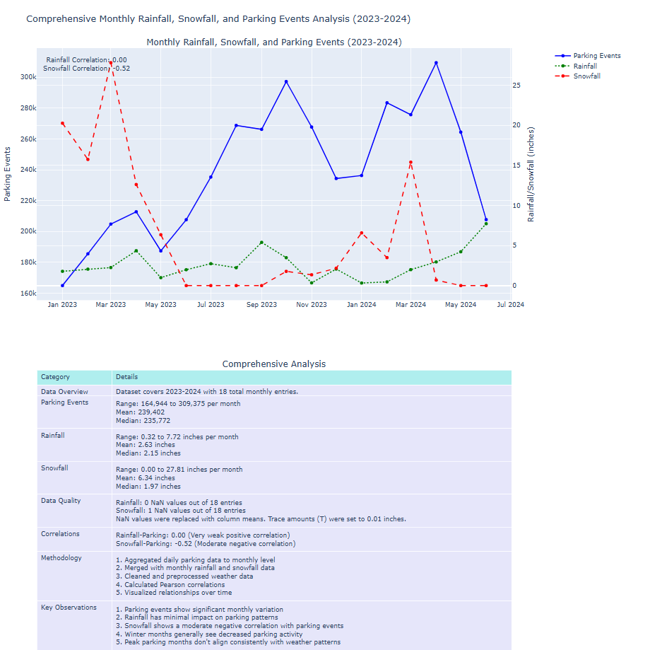
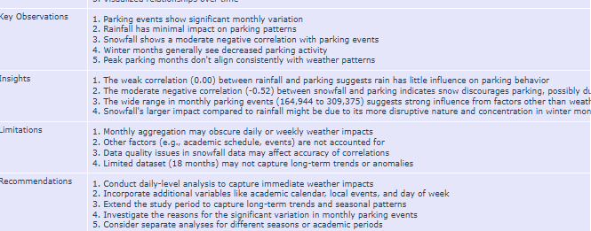
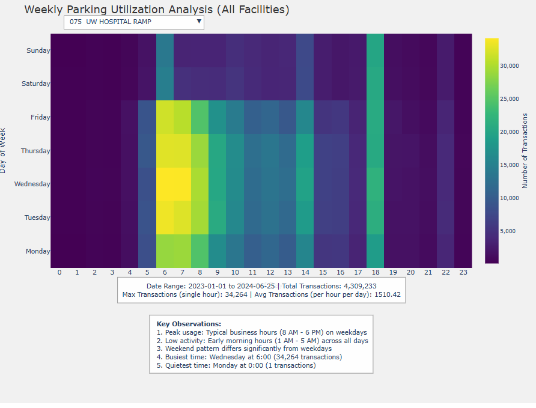
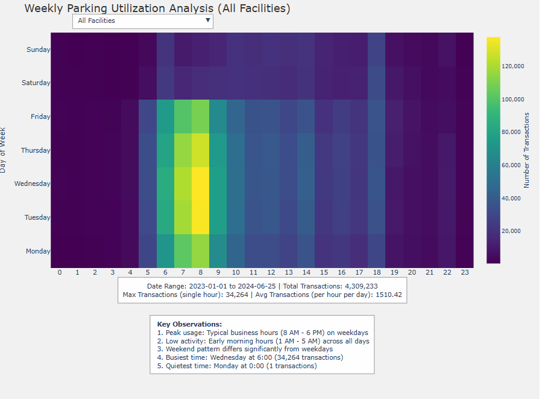
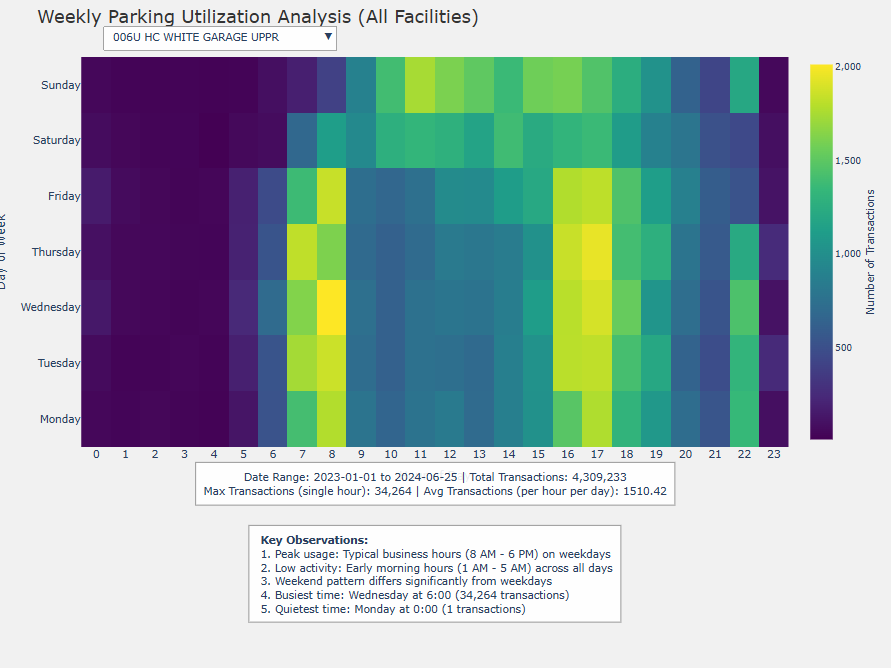
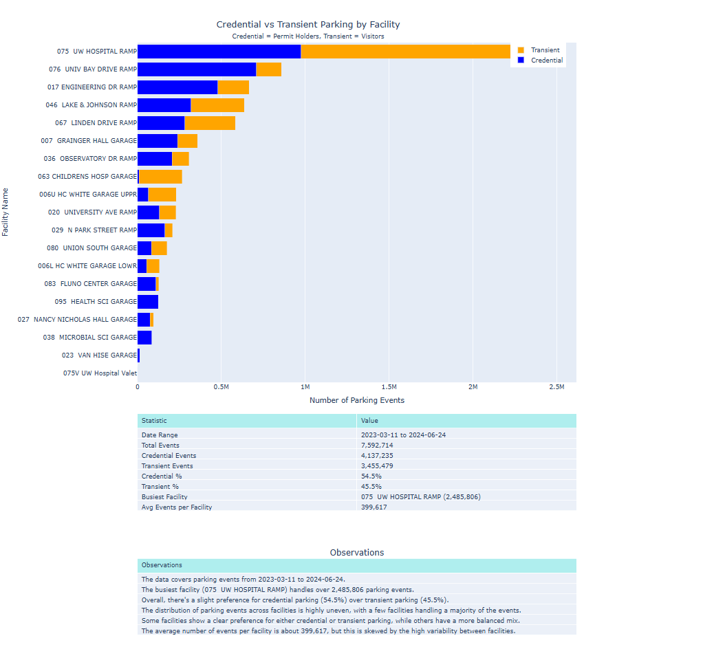
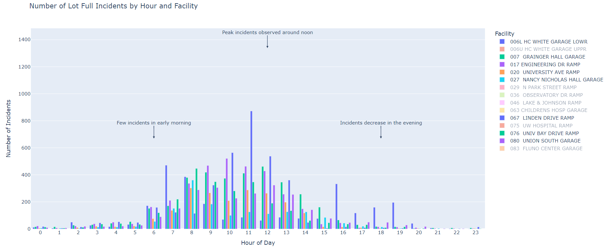
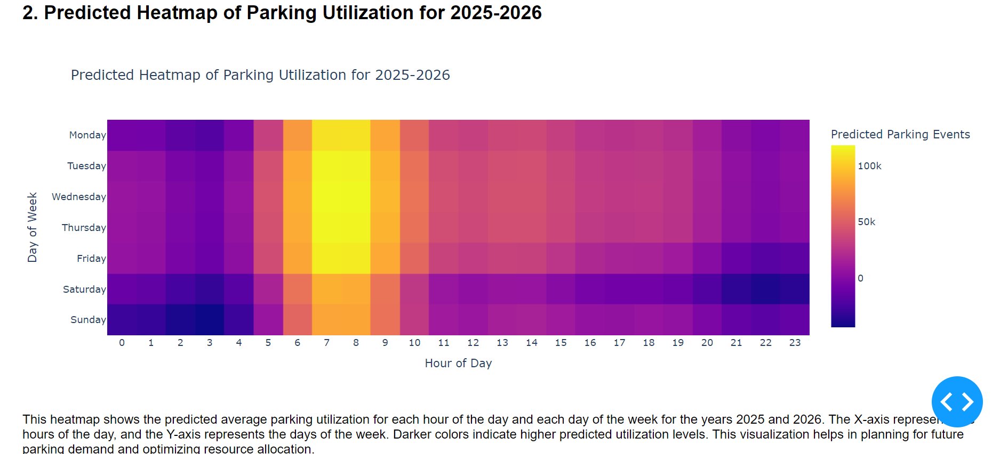

# UW Transportation Services — Campus Parking Efficiency Project

A data-driven analysis of parking utilization, weather impact, and demand forecasting across the University of Wisconsin–Madison campus.

**Summer Internship · University of Wisconsin–Madison · LIS 620 · June – August 2024**
In partnership with **UW Transportation Services**


---

## Overview

Over the summer of 2024, our team worked with UW Transportation Services to analyze parking operations across the University of Wisconsin–Madison campus. The department manages a large network of ramps and garages that together generate millions of transaction records each year, yet decisions about pricing, staffing, and capacity were being made without a consolidated, evidence-based picture of demand.

This internship set out to change that. Working with roughly **7.6 million parking transactions (March 2023 – June 2024)**, we built interactive dashboards, grouped facilities by operational behavior, measured the relationship between weather and demand, and produced a forward-looking forecast of future utilization. The result is a set of tools and findings that let Transportation Services plan capacity and pricing on the basis of data rather than intuition.

---

## Objectives

- Identify where and when parking demand concentrates across campus.
- Determine which facilities behave alike and which require distinct management strategies.
- Quantify whether weather conditions (rain, snow) meaningfully affect parking behavior.
- Forecast future demand to support longer-term capacity and staffing planning.

---

## Key Visualizations and Findings

### Parking Utilization Heatmap — Day × Hour

Average parking events by day of week and hour of day. A pronounced weekday morning peak (roughly 7–9 AM, Monday through Friday) dominates the week, while weekends are markedly quieter — consistent with demand driven by commuters and class schedules.



### Predicted Utilization Heatmap (2025–2026)

A forward-looking projection of the same day-by-hour pattern, intended to support future capacity and staffing decisions.



### Per-Facility Utilization

The dashboard allows staff to examine any individual facility. Patterns differ substantially across the network — for example, the UW Hospital Ramp shows a steady weekday-business peak, while HC White Garage (Upper) shows a distinct late-afternoon surge. These differences demonstrate that a single uniform schedule does not fit every facility.

| All Facilities | UW Hospital Ramp | HC White Garage (Upper) |
|:--:|:--:|:--:|
|  |  |  |

### Lot-Full Incidents by Hour and Facility

A count of how often each facility reaches capacity, broken out by hour. Incidents cluster around midday, are rare in the early morning, and taper off through the evening — pinpointing the specific facilities and hours that warrant attention.



### Facility Clustering (K-Means)

Using K-means clustering on occupancy rate, turnover rate, average daily usage, and average parking duration, we grouped facilities into behavioral clusters. This enables Transportation Services to apply targeted strategies — such as differentiated pricing or time limits — to each cluster rather than treating the network uniformly.



### Weather Correlation Analysis

We merged daily transaction data with local rainfall and snowfall records and computed Pearson correlations. Rainfall showed essentially no relationship with demand (≈ 0.00), while snowfall showed a moderate negative correlation (≈ −0.52), indicating that snow measurably discourages parking activity. This is a useful, somewhat counterintuitive result for winter operations planning.



---

## Impact

- **Evidence over intuition.** Transportation Services now has clear, visual confirmation of peak windows, per-facility behavior, and the limited role of weather in driving demand.
- **Targeted strategy.** Facility clustering allows pricing and time-limit decisions to be tailored by group rather than applied uniformly across the network.
- **Forward planning.** The 2025–2026 demand forecast provides a concrete basis for capacity and staffing decisions.
- **A reusable tool.** The interactive Dash dashboard lets staff explore any facility on demand, rather than relying on a static report.

---

## Tech Stack and Methods

**Languages and Libraries:** Python · Pandas · NumPy · SciPy · Plotly · Dash · scikit-learn

**Methods:**
- Data cleaning and preprocessing (handling missing values, trace-amount weather readings, monthly aggregation)
- Time-series analysis and forecasting (Prophet, ARIMA)
- K-means clustering of facility behavior
- Pearson correlation analysis (weather vs. demand)
- Interactive dashboard development

---

## Repository Structure

| File | Description |
|------|-------------|
| `Dashboard5.py` | Interactive Dash dashboard for exploring per-facility utilization |
| `FinalViz1.py` | Lot-full incidents by hour and facility |
| `FinalViz2.py` | _Visualization script — update with description_ |
| `FinalViz3A.py` | _Visualization script — update with description_ |
| `FinalViz3B.py` | _Visualization script — update with description_ |
| `FinalViz5.py` | _Visualization script — update with description_ |
| `images/` | Generated charts and dashboard exports |

---

## Running the Project

```bash
# clone
git clone https://github.com/HarshMehta9000/LIS620Parking.git
cd LIS620Parking

# (recommended) virtual environment
python -m venv venv
source venv/bin/activate        # Windows: venv\Scripts\activate

# install dependencies
pip install pandas numpy scipy plotly dash scikit-learn prophet statsmodels

# run the dashboard
python Dashboard5.py
```

> The raw parking transaction data is provided by UW Transportation Services and is not included in this repository. Update the data paths in each script to point to your local copy.

---

## Team

Completed by a student team for LIS 620 during a summer internship with UW Transportation Services.

- Harsh Mehta
- Tanmay Maity
- Vaishnavi Kale

---

## Notes and Limitations

- Monthly aggregation can obscure daily weather effects; daily-level analysis is a natural next step.
- Facility capacity was assumed (approximately 100 spaces, 24/7 operation) where real capacity data was unavailable.
- The roughly 18-month window may not capture long-term trends or anomalies such as semester breaks or large campus events.
- Drivers beyond weather — the academic calendar, campus events — were not modeled and likely account for much of the observed variation.
